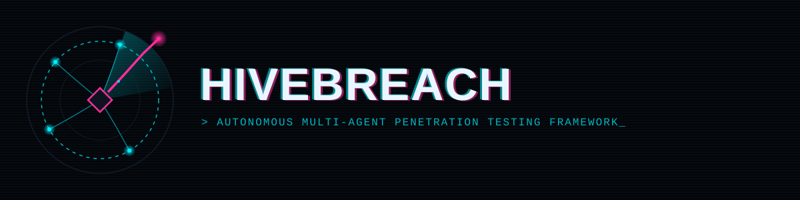

<p align="center">
  
</p>

<p align="center">
  
</p>

# HiveBreach

**v1.0.0** — Autonomous Multi-Agent AI Penetration Testing Framework

HiveBreach deploys a coordinated **swarm of 18 specialist AI agents** that map your attack surface, hunt vulnerabilities, generate validated PoCs, and produce remediation reports. Every finding is cross-verified before it reaches the report — no hallucinated vulnerabilities survive the pipeline.

---

## Quick Start

```bash
npm install
npm run build

# Deep scan (full 16-agent sweep)
node dist/cli/index.js scan https://example.com --mode deep

# CI scan (fast 7-agent pass, ~10 min for PRs)
node dist/cli/index.js scan https://example.com --mode ci

# List available commands
node dist/cli/index.js --help
```

### Prerequisites
- **Node.js 22+**
- **Docker** (optional, for sandbox validation)
- **Ollama** (optional, for free local LLM — falls back to NVIDIA NIM or paid API)

---

## Architecture

```
                            ┌──────────────┐
                            │  LLM Router  │ ollama | nim | openai | anthropic
                            └──────┬───────┘
                                   │
                          ┌────────▼────────┐
                          │ AI Orchestrator │ plans, delegates, resolves conflicts
                          └────────┬────────┘
                                   │
              ┌──────────────┬─────┴─────┬──────────────┐
              │              │           │              │
         ┌────▼──────┐   ┌────▼────┐  ┌───▼────┐   ┌────▼────┐
         │Scope Gate │   │Comm Bus │  │Sanity  │   │Approval │
         │(hard wall)│   │(msg-pub)│  │Checks  │   │  Gate   │
         └───────────┘   └─────────┘  └────────┘   └─────────┘
              │
    ┌─────────┼─────────┬─────────┬─────────┬─────────┐
    │         │         │         │         │         │
┌───▼──┐  ┌───▼───┐ ┌───▼───┐ ┌───▼───┐ ┌───▼───┐ ┌───▼───┐
│Recon │  │Web    │ │Cloud  │ │Mobile │ │SCA    │ │Secret │
│Agent │  │Expert │ │Expert │ │App    │ │SBOM   │ │Agent  │
└──────┘  └───────┘ └───────┘ └───────┘ └───────┘ └───────┘
    │         │         │         │         │         │
    └─────────┼─────────┴─────────┴─────────┴─────────┘
              │
         ┌────▼────┐    ┌───────────┐
         │Verify & │───▶│  Report   │ + OWASP + MITRE + CWE/CVSS + Compliance
         │Correlate│    │  Agent    │
         └─────────┘    └───────────┘
```

### The Gate
The scope/authorization gate is **deterministic, non-LLM code** — it's the one boundary the AI cannot cross. Targets outside scope are hard-blocked. Credential attacks require explicit RoE authorization.

---

## Agent Roster (18 total)

| # | Agent | Role | Default | Risk |
|---|-------|------|---------|------|
| 1 | Secrets Scanning | Finds leaked API keys, tokens, credentials | Autonomous | Low |
| 2 | SCA/SBOM | Dependency CVE scanning (Grype/NVD) | Autonomous | Low |
| 3 | Threat Modeling | Risk-ranked agent dispatch order | Autonomous | Low |
| 4 | Recon | Attack surface mapping + deep fingerprinting | Autonomous | Low |
| 5 | Path Discovery | Hidden dirs, .git, .env, backup files | Autonomous | Low |
| 6 | Web Expert | SQLi, XSS, SSRF, auth flaws | Scope-gated | Medium |
| 7 | API Testing | BOLA, GraphQL injection, mass assignment | Scope-gated | Medium |
| 8 | Active Testing | Burp-MCP + curl + ZAP active replay | Scope-gated | Medium |
| 9 | Cloud Expert | AWS/Azure/GCP misconfig, IAM | Scope-gated | Medium |
| 10 | Network Expert | Lateral movement, AD path mapping | Sandbox-only | High |
| 11 | Server-Side | TLS, exposed services, outdated daemons | Scope-gated | Medium |
| 12 | Client-Side | DOM XSS, CSP, vulnerable JS libraries | Scope-gated | Low |
| 13 | Mobile App | MobSF, Frida, hardcoded secrets | Scope-gated | Medium |
| 14 | Password/Credential | Hydra, hashcat (sandbox-only default) | Sandbox-only | Highest |
| 15 | Wireless | Aircrack-ng (separate RoE required) | Requires-RoE | High |
| 16 | Exploit/PoC | Weaponizes findings, sandbox validation | Sandbox-only | High |
| 17 | Verification | Two-track cross-check + sandbox repro | Autonomous | — |
| 18 | Cleanup/Teardown | Removes artifacts, always runs last | Autonomous | Low |
| — | Report Agent | OWASP/MITRE/CWE/CVSS tagged output | Autonomous | — |

---

## LLM Backend

| Backend | Cost | Requires |
|---------|------|----------|
| **Ollama** (local) | Free | GPU (optional, works CPU-only) |
| **NVIDIA NIM** | Free | API key, ~40 req/min |
| **OpenAI** | Paid | API key |
| **Anthropic** | Paid | API key |

Default: Ollama. Falls back gracefully. Paid APIs are opt-in upgrades for high-stakes reasoning.

---

## Verification Pipeline (Anti-False-Positive)

Every finding passes through **three independent checks** before reaching the report:

1. **Cross-agent corroboration** — did 2+ independent agents/tools see the same signal?
2. **Sandbox reproduction** — can the PoC actually reproduce in Docker?
3. **Two-track model** — exploit-verified (sandbox, high confidence) vs state-verified (config confirmed, medium confidence)

Low/info findings get lighter verification — Critical/High findings get the full triple-check.

---

## Scan Modes

| Mode | Agents | Time | Use Case |
|------|--------|------|----------|
| `ci` | 7 | ~10 min | PR diff — secrets + SCA + threat model + active + verify |
| `deep` | 16 | ~120 min | Scheduled/manual — full attack-surface sweep |

```bash
node dist/cli/index.js scan --mode ci https://staging.example.com
node dist/cli/index.js scan --mode deep https://production.example.com
```

---

## Standards & Compliance

Every report automatically tags findings against:

- **OWASP Top 10** + **API Security Top 10** (combined "Top 20")
- **MITRE ATT&CK** — Tactic/Technique ID
- **CWE** — Root cause classification
- **CVSS** — Numeric severity scoring
- **Compliance mapping** — PCI-DSS 4.0, ISO 27001:2022, SOC 2, NIST SP 800-53

---

## Tool Belt (25 tools registered)

| Category | Tools |
|----------|-------|
| Recon | nmap, masscan, amass, subfinder, httpx, ffuf, gobuster, wafw00f, whatweb |
| Web | sqlmap |
| Cloud | prowler, scoutsuite, trivy |
| Network | bloodhound, impacket |
| Mobile | mobsf, frida |
| Wireless | aircrack-ng |
| Secrets | gitleaks, trufflehog, git-dumper |
| Credential | hydra, hashcat, john |
| Exploit | metasploit |

```bash
node dist/cli/index.js list-tools
node dist/cli/index.js list-tools --category secrets
```

---

## Built-in Governance

- **Human approval gate** — Critical/High findings queue for review before shipping
- **Rate-limit governor** — Tracks NIM 40/min cap + paid API costs
- **Encrypted secrets vault** — Live credentials never touch plain findings logs
- **Immutable audit trail** — Every agent action logged (reconstructable post-scan)
- **Plugin architecture** — Community can add agents without forking core

---

## Project Structure

```
HIVE-BREACH/
├── src/
│   ├── types/          # All shared types (zod-validated)
│   ├── config/         # hivebreach.config.json loader
│   ├── llm/            # Provider-agnostic router (ollama/nim/openai/anthropic)
│   ├── skills/         # Skill library loader + CVE/KEV auto-ingestion
│   ├── agents/         # Base agent, registry, loader, 18 implementations
│   ├── orchestration/  # Orchestrator, scope gate, sanity checks, comm bus
│   │                   #   scan modes, human approval gate, rate-limit governor
│   ├── toolbelt/       # Tool registry + recommender
│   ├── execution-engine/  # Docker sandbox + encrypted secrets vault
│   ├── governance/     # Compliance mapper + attack-path visualizer
│   └── cli/            # Commander-based CLI
├── agents/             # 18 agent card YAML files
├── skills/             # Skill playbooks (web, cloud, api, mobile)
├── toolbelt/           # registry.json (25 tools)
├── governance/         # RoE template
├── integrations/       # GitHub Action workflow
├── branding/           # Logo, banner, alternates
├── tests/              # 19 integration tests
├── hivebreach.config.json
├── package.json
└── tsconfig.json
```

---

## Commands

```bash
hivebreach scan <target>       # Run a security scan
  --mode ci|deep               #   Scan depth (default: deep)
  --type url|domain|ip|repo    #   Target type
  --config <path>              #   Config file path
  --output <path>              #   Report output path

hivebreach list-tools          # List security tools
  --category <cat>             #   Filter by category
  --installed                  #   Show only installed

hivebreach list-agents         # List expert agents
hivebreach list-modes          # List scan modes (ci/deep)
```

---

## Configuration

Create `hivebreach.config.json`:

```json
{
  "llm": {
    "provider": "ollama",
    "model": "qwen2.5",
    "baseUrl": "http://localhost:11434"
  },
  "defaultScope": {
    "authorizedTargets": ["example.com"],
    "timeBudgetMinutes": 60,
    "allowCredentialAttacks": false,
    "wirelessTestingAuthorized": false
  }
}
```

---

## Legal & Ethical Notice

HiveBreach is designed exclusively for **authorized security testing** — systems you own, or systems you have explicit written permission to test under a signed Rules of Engagement. The scope/authorization gate is deterministic and non-removable. Operating without it, or against targets without permission, is unauthorized access.

---

<p align="center">
  <b>Built with 18 agents, 25 tools, 5 compliance standards, and 4 LLM backends.</b><br/>
  TypeScript, Commander, Zod, YAML, picocolors, Docker, and Ollama/NIM/OpenAI/Anthropic.
</p>
